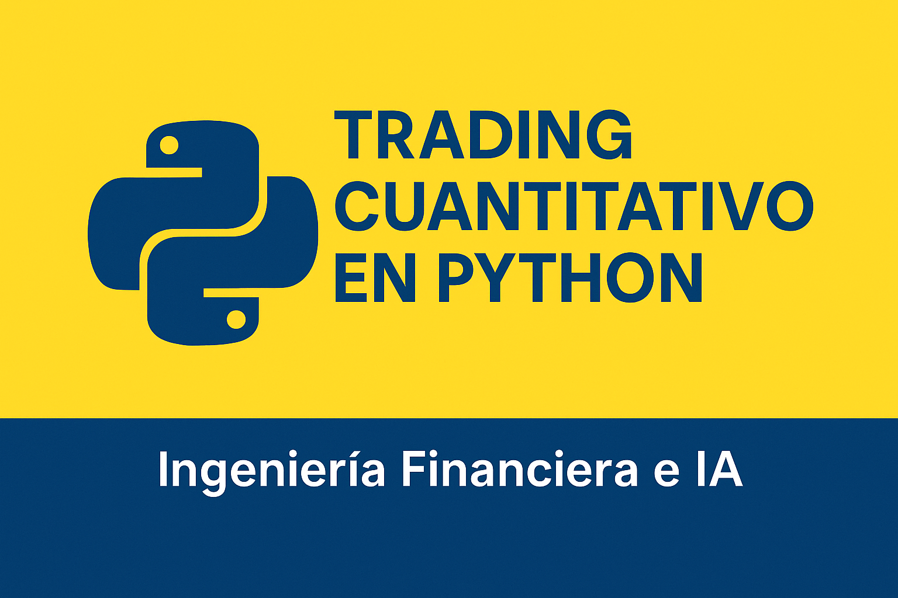

    

# Apuntes del curso

> Este repositorio contiene los apuntes del curso Trading Cuantitativo en Python: Ingeniería Financiera e IA. 

## Índice

### Apuntes
- [Conceptos Clave](apuntes/conceptos-clave.md)
- [Conciencia, Disciplina, Compromiso y Perseverancia](apuntes/consejo.md)
- [Cómputo Paralelo y Secuencial](apuntes/computo-paralelo-y-secuencial.md)
- [Comparativa: Velocidad y Eficiencia](apuntes/comparativa-velocidad-y-eficiencia.md)

### Código
- [01 - Herencia entre Clases](codigo/01-herencia-entre-clases)
  - [Clases en Python](codigo/01-herencia-entre-clases/01-clases-en-python.py)
  - [Herencia entre Clases](codigo/01-herencia-entre-clases/02-herencia-entre-clases.py)

- [02 - Cómputo Paralelo en Python](codigo/02-computo-paralelo-en-python)
  - [Hilos (Threads)](codigo/02-computo-paralelo-en-python/02-hilos-threads.py)
  - [Procesamiento](codigo/02-computo-paralelo-en-python/02-procesos.py)
  - [Sincronizadores](codigo/02-computo-paralelo-en-python/03-sincronizadores-y-uso-de-join.py)
